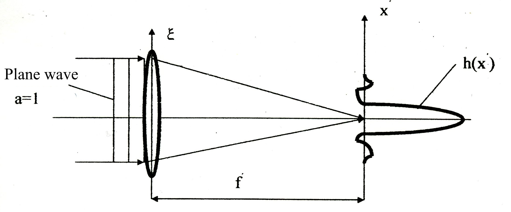
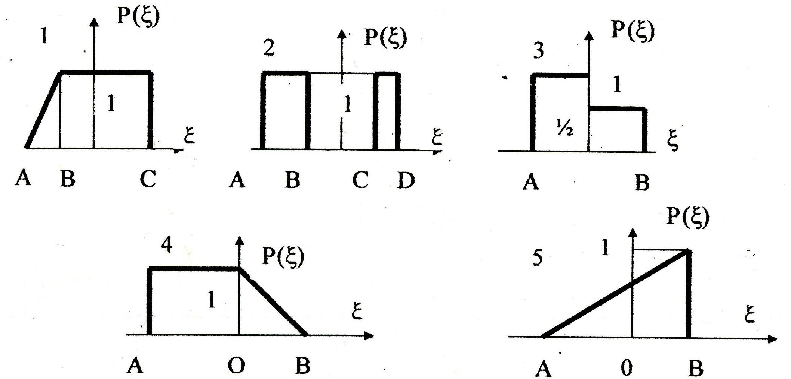
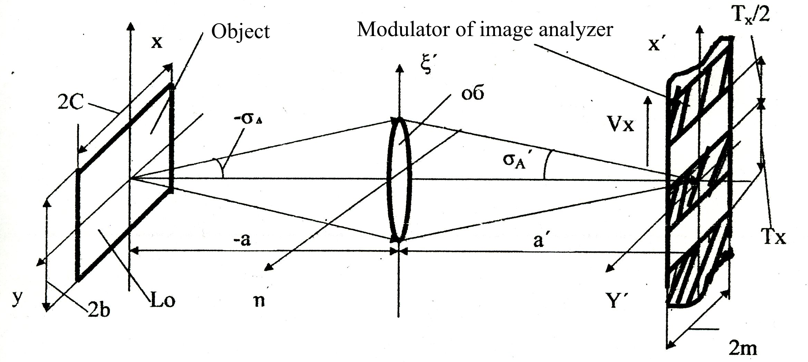

# Optoelectronic Systems Theory Assignment

1. For a cylindrical diffraction-limited optical system, on which a plane monochromatic wave with length $\lambda$ and amplitude $A=1$ falls, find:

    1. A coherent transfer function $\tilde{h}(\nu_x)$ and plot its graph
    2. An optical transfer function $\tilde{H}_N^{OS}(\nu_x)$ and plot its graph

2. Find a polychromatic transfer function $\tilde{H}^{PC}(\nu_x)$ for the radiation of a corresponding blackbody with temperature $T$, if the image is formed in the rear focal plane, and the spectral sensitivity of the radiation receiver is approximated by a Gaussian distribution with a mathematical expectation of 600 nm and a standard deviation of 100 nm.

3. Find the time-frequency spectrum of the radiation flux $\tilde{\Phi}_t(\nu_t)$ and the magnitude of the radiation flux $\Phi_t(t)$ in the image analysis plane of the optical system at the output of the modulator of the image analyzer during its linear scanning and plot their graphs. The optical system is a lens with a normalized scattering function $H_N^{OS}(x', y')=\delta(x', y')$, the source of radiation is an object in the form of a rectangle with a constant energy brightness $L_0$, the study of which obeys Lambert's law. The modulator of the image analyzer is a lattice with a cosine distribution of the transmission coefficient along the x axis.

